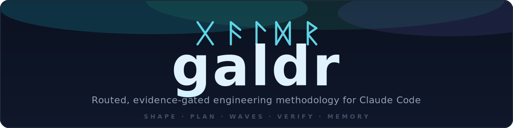

<p align="center">
  
</p>

<p align="center">
  
  <a href="CHANGELOG.md"></a>
  <a href="skills/"></a>
  
  
</p>

<h1 align="center">galdr</h1>

<p align="center">
  <b>One methodology pack that takes a rough idea all the way to a reviewed, merged branch:<br>
  a failing test before every line, fresh evidence before every "done,"<br>
  and a memory that survives a dead session.</b>
</p>

<p align="center">
  <a href="#why-i-built-this">Why</a> ·
  <a href="#the-flow">Flow</a> ·
  <a href="#the-skills">Skills</a> ·
  <a href="#example-a-rough-idea-made-buildable">Examples</a> ·
  <a href="#proven-not-promised">Proven</a> ·
  <a href="#install">Install</a> ·
  <a href="#use">Use</a>
</p>

<p align="center">
  <i>galdr</i>: Old Norse for "incantation." A personal engineering methodology for Claude Code:
  routed requests, wave-based TDD-first plans, evidence gates, subagent execution, and durable memory.
</p>

---

## Why I built this

I was running multiple skill packs at once: overlapping bootstraps, competing conventions, and a standing context cost I paid on every single session. Neither matched how I actually work: shape an idea into a spec, turn it into a wave-based TDD plan, run it with subagents behind evidence gates, and keep durable memory so nothing is lost across a `/clear` or a dead session.

So I built one pack that *is* that method, small enough to leave on all the time, and held to the same standard it holds your code to: every discipline rule was tested against an agent that didn't have it before it shipped.

## The flow

galdr routes every substantive request to the right amount of process (no more, no less), then runs a disciplined path from idea to merge.


> **Always on, inside every task:** [`tdd`](skills/tdd/SKILL.md) (failing test first) · [`verify`](skills/verify/SKILL.md) (fresh evidence, skip-count included) · [`debug`](skills/debug/SKILL.md) (root cause before any fix).

- [**`shape`**](skills/shape/SKILL.md): turns a fuzzy idea into a written spec. Grills you one decision at a time, each with a recommendation, until nothing is ambiguous.
- [**`plan`**](skills/plan/SKILL.md): turns the spec into a wave-based task DAG: write-scoped, independently testable tasks with declared dependencies.
- [**`waves`**](skills/waves/SKILL.md): executes the tasks with subagents, wave by wave, gating each wave on real evidence, not a subagent's "done."
- [**`review`**](skills/review/SKILL.md): a fresh-context reviewer checks the work against the spec first, then against code quality.
- [**`branches`**](skills/branches/SKILL.md): finishes: full gate run, a manual smoke sheet, and a merge/push decision that is always yours.

What keeps it honest:

- **Evidence gates.** Every RED, GREEN, gate, and review verdict is a greppable `EV` line in `memory-progress.md`, tied to the commit that produced it.
- **Durable memory.** State lives in `memory.md` and `memory-progress.md`. A new session reads them first and re-verifies claims with commands, so work survives `/clear`, compaction, and session death.
- **Crash-safe.** Park is two explicit levels: soft (in-flight work finishes) and hard (flush in under two minutes, never wait). If a session dies with no warning (battery, network, a hard limit), the next session detects it from the ledger alone, salvages what landed, and resumes.
- **Usage-aware.** A pre-dispatch guard parks the run before it burns past your 5-hour / 7-day limit and resumes cleanly; each wave reports tokens spent and your real usage %.
- **A self-managing backlog.** Deferred work is captured automatically in `docs/backlog.md` and proposed back to you when a cycle finishes. Nothing gets forgotten.

## The skills

18 skills, each also a slash command (`/galdr:<name>`).

**Always on: inside every session and task** (injected by the [bootstrap](hooks/bootstrap.md))

| Skill | What it does |
|---|---|
| [`route`](skills/route/SKILL.md) | Reads each request and picks the entry point, or none. Announces its choice in one line. |
| [`tdd`](skills/tdd/SKILL.md) | No production code without a failing test first. |
| [`verify`](skills/verify/SKILL.md) | No "done" without fresh evidence: skip-count included. |
| [`continue`](skills/continue/SKILL.md) | Resume after a break, park cleanly (soft or hard) under a limit, and recover automatically after a crashed session. |
| [`using-galdr`](skills/using-galdr/SKILL.md) | Tells confusable skill pairs apart when you're unsure which to use. |

**The main flow: idea to merge** (router- or command-invoked)

| Skill | What it does |
|---|---|
| [`shape`](skills/shape/SKILL.md) | Fuzzy idea → a written, testable spec, one decision at a time. |
| [`plan`](skills/plan/SKILL.md) | Spec → a wave-based DAG of write-scoped, testable tasks. |
| [`waves`](skills/waves/SKILL.md) | Runs the tasks with subagents, gating each wave on real evidence. |
| [`review`](skills/review/SKILL.md) | Fresh-context check: against the spec first, then against code quality. |
| [`branches`](skills/branches/SKILL.md) | Finish: full gate run, smoke sheet, and a merge decision that's yours. |
| [`debug`](skills/debug/SKILL.md) | Root cause before any fix. |

**On demand: user-invoked on-ramps and tools**

| Skill | What it does |
|---|---|
| [`prototype`](skills/prototype/SKILL.md) | Answer a design question with throwaway working code instead of a spec. |
| [`rearchitect`](skills/rearchitect/SKILL.md) | Map an architecture pain area read-only, rank it, exit into a plan. |
| [`backlog`](skills/backlog/SKILL.md) | Owns `docs/backlog.md`: captures, lists, and resolves deferred work. |
| [`setup`](skills/setup/SKILL.md) | Writes this repo's `docs/agents/galdr.md`: gates, invariants, model tiers, smoke. |
| [`core`](skills/core/SKILL.md) | Installs, removes, or checks the always-on core rules block per agent (Claude, Codex, Antigravity). |
| [`usage-bridge`](skills/usage-bridge/SKILL.md) | Installs the statusline bridge for real 5h/7d usage % on any machine. |
| [`authoring`](skills/authoring/SKILL.md) | The meta-skill: write or edit galdr skills through its checks. |

## Example: a rough idea, made buildable

Drop a half-formed idea:

> "I think users should be able to export their data."

[`/galdr:shape`](skills/shape/SKILL.md) doesn't start building. It grills, one decision at a time, each with a recommendation you confirm or override:

```
routing: shape-grill — a position to stress-test

Next: which format: CSV, JSON, or both? Recommend CSV first: it's what a
non-technical user opens in a spreadsheet; a JSON export can follow if an API
consumer actually asks. Confirm, or do you need JSON now?
  → CSV

Next: whose data: the user's own records, or everything they can see (team /
shared)? Recommend own records only: it's the clean privacy line and can't leak
a teammate's data. Override?
  → own records

Next: delivery: a direct download, or an emailed link? Recommend a direct
download under ~10k rows and an emailed async link above it: instant for most
people, safe for the large accounts.
  → agreed
```

…and out comes a spec precise enough to hand to any agent (or any engineer) and get exactly the right thing built:

```markdown
# Data export: spec
Goal: let a signed-in user export their own records as a file.

Non-goals: exporting other users' or team-shared data; scheduled / recurring exports.

Constraints:
- own-records-only: an export never includes a row owned by another user.
- format is CSV.
- direct download under 10,000 rows; emailed async link at or above 10,000.

Decisions: format = CSV-first · scope = own-records · delivery = sync-with-async-fallback

Acceptance criteria:
- a user with < 10k rows gets a CSV of exactly their records, nothing else;
- a user with ≥ 10k rows gets an emailed link within the async budget;
- no export ever contains a row owned by a different user.
```

That spec **is** the prompt: unambiguous, testable, and impossible to build two different ways. Everything downstream ([`plan`](skills/plan/SKILL.md) → [`waves`](skills/waves/SKILL.md) → [`review`](skills/review/SKILL.md)) is checked against it.

## Example: idea to merged branch

The full loop:

```
route → shape (spec) → plan (wave DAG) → waves (subagents, RED-first, evidence gate
per wave) → review (spec + quality) → branches (gate, smoke sheet, merge decision)
```

Every wave dispatches subagents that commit their own atomic red-green pairs; every return is reviewed against its brief before it's trusted; every gate writes `EV` lines. galdr's own `0.2`–`0.5` releases (the budget guard, live progress + usage reporting, the [usage-bridge](skills/usage-bridge/SKILL.md) installer, and the self-managing [backlog](skills/backlog/SKILL.md)) were each built exactly this way, start to finish.

Each dispatch runs at a model tier read from this repo's own `docs/agents/galdr.md`, which maps each tier to a model. A failing task gets three attempts: retry, then escalate one tier (mechanical → standard → top) and retry once, then the wave stops rather than grind. On the Workflow runtime, `shape` adds one more independent check: a draft spec gets a second opinion from a reviewer dispatched at the repo's `spec-review` tier before you see it.

## Proven, not promised

Every rule in this pack was tested against an agent that didn't have it: the same protocol the pack prescribes for your code, applied to the pack itself.

<details>
<summary><b>The receipts</b>: pressure tests, router accuracy, reviews, line budgets</summary>

<br>

- **Pressure-tested discipline.** Every discipline skill ran RED first: a baseline agent, no skill, real fixtures. The baselines failed the way real sessions fail: edited production code on a "tests after" nudge, retrofitted tests around untested code, mocked on request without a seam, investigated a live payments incident without ever mitigating it. With the skill loaded, every one of those failures reversed: 12/12 GREEN scenarios, zero forbidden behaviors.
- **A router that earns its overhead.** 16/16 routing accuracy on the full request set, zero fast-path violations across every run, including the negatives (i18n, registry, migration, cross-repo) designed to tempt it into skipping ceremony. When a run disagreed with the answer key, the key was wrong: the router had applied the spec more faithfully than its own test.
- **Reviewed like it reviews you.** Every skill went through fresh-context two-verdict review (spec compliance, then quality). The reviews caught real defects (a project binding hardcoded into a generic skill, an interface mismatch between siblings, a missing file convention), and every fix was re-reviewed to RESOLVED.
- **Lean enough to always be on.** The v0.1 core was 15 skills + bootstrap in 1,934 lines (superpowers spent 3,150 on 14), with a standing context cost of ~1,240 tokens: the bootstrap and one-line triggers are all a session carries until a skill actually fires.
- **An audit trail, not a changelog claim.** Every RED, GREEN, review verdict, and gate lives as a greppable `EV` line in `memory-progress.md`, tied to the commit that produced it.
- **Built by itself.** Releases `0.2` through `0.5` were each shaped, planned, wave-executed, reviewed, and shipped through galdr's own flow, with adversarial review at every gate.

</details>

## Install

galdr runs on three runtimes: Claude Code, OpenAI Codex, and Google Antigravity. Pick the one you use; the skills land the same way on all three. Only the always-on core hook differs per runtime, wired by `/galdr:core install <runtime>`.

### Claude Code

1. Add the marketplace and install the plugin:
   ```
   /plugin marketplace add nyelonong/galdr
   /plugin install galdr@nyelonong
   ```
2. **Enable the always-on core** (optional, one-time). Skills work as slash commands the
   moment you install. The `SessionStart` [hook](hooks/session-start) (which injects the Iron Laws, routing, and
   voice into *every* session and re-applies them after `/clear`) ships **disabled**, so
   installing galdr doesn't silently take over all your sessions or collide with another
   pack's hook. Flip it on once. The config lives at a stable path, so it survives plugin
   updates:
   ```
   /galdr:core install claude
   ```

### OpenAI Codex

1. Land the 18 skills:
   ```
   npx skills add nyelonong/galdr
   ```
2. Enable the always-on core (optional, one-time). This writes the marked core block into
   `~/.codex/AGENTS.md`:
   ```
   /galdr:core install codex
   ```

### Google Antigravity

1. Land the 18 skills:
   ```
   npx skills add nyelonong/galdr
   ```
2. Enable the always-on core (optional, one-time). This writes the marked core block into
   `~/.gemini/AGENTS.md`:
   ```
   /galdr:core install antigravity
   ```

### After install (all runtimes)

1. Wire each repo once: [`/galdr:setup`](skills/setup/SKILL.md) (writes `docs/agents/galdr.md`: gate commands, invariants, model tiers, thresholds, smoke config).
2. Optional, once per machine (Claude Code only): [`/galdr:usage-bridge install`](skills/usage-bridge/SKILL.md): real 5h/7d usage % and the quota-threshold park, even where your statusline doesn't already write the cache.

Then just work. The router picks the right path on every substantive request.

## Use

With the hook enabled, the [router](skills/route/SKILL.md) runs on any substantive request and announces its pick in one line (`routing: <destination> — <reason>`); one word from you overrides it. Every skill is also a slash command (`/galdr:<name>`), so you can enter the flow directly at any point.

- **Direct on-ramps:** [`/galdr:debug`](skills/debug/SKILL.md) (a reported bug: root cause before fix), [`/galdr:prototype`](skills/prototype/SKILL.md) (a design question faster answered by a throwaway build than a spec), [`/galdr:rearchitect`](skills/rearchitect/SKILL.md) (architecture pain with no specific feature).
- **Review the backlog:** [`/galdr:backlog`](skills/backlog/SKILL.md) lists open deferred work; the deferring skills append to it automatically, and [`branches`](skills/branches/SKILL.md) finish proposes it back to you.
- **Not sure which skill?** [`/galdr:using-galdr`](skills/using-galdr/SKILL.md) tells confusable pairs apart (shape vs prototype, review vs verify, debug vs tdd, plan vs waves).

Skills stay generic; each repo's specifics live in `docs/agents/galdr.md` from [`/galdr:setup`](skills/setup/SKILL.md).

## Usage bridge

[`/galdr:usage-bridge install|uninstall|status`](skills/usage-bridge/SKILL.md) installs a statusline wrapper that writes `~/.claude/rate-limits-cache.json`, so the real 5h/7d usage % and the quota-threshold park work on any machine, not just where the official statusline already populates that cache. It wraps whatever statusline you already have non-destructively (delegating to it after writing the cache) and is fully reversible: `install` sets it up, `uninstall` restores your original statusline, `status` reports which state you're in.

## Under the hood

| | |
|---|---|
| [Bootstrap](hooks/bootstrap.md) | The ~46-line context block injected every session. |
| [CHANGELOG](CHANGELOG.md) | Every release, `0.1` onward. |

The full design spec, testing protocol, and router-accuracy set live in the private development repo, which is the canonical source this pack is published from.
