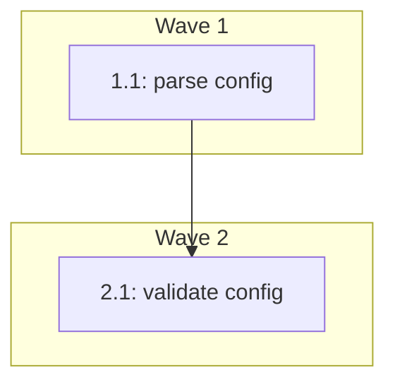

# plan

Turns an approved spec into `docs/plans/YYYY-MM-DD-<topic>.md`: a wave-based task list
that `waves` executes wave by wave, gating on evidence at the end of each wave. Plan
never writes implementation code — it decides what the tasks are, how they depend on
each other, and what each one must produce.

## Plan file format

Every plan file has, in order:

- **Header**: Goal (one paragraph), Architecture (what's being built and the tech
  involved), and a **Global Constraints** block (see below).
- **Waves**: one section per DAG level (see "Waves are DAG levels"), each ending in a
  wave gate.
- **Per task**: Files (create/modify), write-scope, Consumes/Produces, seams, test
  list, acceptance checkboxes, and a model tier line only when it overrides the default.

Example task entry (compressed; a real one also has step-by-step checkboxes):

```
### Task 2.3: <name>
**Files:** Create `path/a.go`, modify `path/b.go`
**Write-scope:** path/a.go, path/b.go
**Consumes:** UserID (string, branded) from Task 1.4's repository interface
**Produces:** ListUsers(ctx) ([]User, error) — used by Task 3.1
**Seams:** repository boundary — integration test against the real store
**Tests:** TestListUsers_Empty, TestListUsers_Paginated
**Model tier:** haiku (mechanical: renames only)
- [ ] Step 1: ...
```

## Progress table

Every plan file carries, at the top — right after the header, before Waves — a
`## Progress` table:

| Task | Wave | Status | Evidence |
|------|------|--------|----------|
| 1.1  | 1    | pending | — |

Status is one of: pending, in-progress, complete, blocked, failed. Evidence is a commit
SHA or an `EV` line reference from `memory-progress.md`. `plan` seeds every row `pending`
with no evidence when it first writes the file.

This table is a derived view, never an independent source of truth: `waves` regenerates
it at each wave gate from `memory-progress.md`, and nobody hand-edits it in between.
`memory.md` / `memory-progress.md` remain the only durable state — the table just makes
that state readable from the plan doc without grepping it.

## Diagram

A fenced ` ```mermaid ` `flowchart`, right after the Progress table and before Waves —
no separate file, no image. One `subgraph` per wave (`Wave N`), one node per task
(`<task id>: <short name>`), edges only for blocking Consumes/Produces dependencies.
Same-wave tasks never get an edge — see the frontier rule below — so every edge crosses
a wave boundary. Generated once, with the Waves sections, from the same task list;
`waves` never regenerates it at a gate (structure, not status), but re-sync it in the
same edit if the plan is later amended. Example, two waves, one cross-wave edge:



## Waves are DAG levels

Build the task dependency graph using blocking edges only (task B needs an artifact
from task A, not just "A happens to relate to B"). A wave is one topological level of
that graph. The **frontier** is the full set of tasks with no unresolved blocking edge
at that point — every task in the frontier is dispatched in the same wave, same
response, in parallel.

## Write-scope discipline

Every task declares its write-scope: the exact files and directories it may touch. Two
tasks in the same wave with overlapping write-scopes is a **plan error**, fixed before
dispatch, never during — either move one task to a later wave (make it depend on the
other), or split the shared file's ownership so only one task edits it while the other
consumes what the first produces. Never dispatch a wave with an unresolved overlap and
rely on the two subagents to "just be careful" — write-scopes exist so the plan itself
proves safety, not the subagents' judgment at dispatch time.

## Task sizing

A task is the smallest unit that (a) has its own RED→GREEN test cycle and (b) is worth
a reviewer stopping to check — not a one-line edit, not an entire feature. It must also
fit inside one subagent's context: the files it touches, plus what's needed to
understand them, must be readable and editable in a single dispatch. Too small wastes a
review gate; too large starves context or hides unrelated changes behind one review.

## Consumes/Produces

State exact names and types, not descriptions. "Produces: a repository" is not
plan-grade; "Produces: `UserRepository` interface with `FindByID(ctx, UserID) (*User,
error)`" is. A task that consumes something names the exact producing task; a task that
produces something names every task listed as consuming it — what lets self-review
catch mismatches before dispatch.

## Global Constraints block

Copy this block verbatim from the spec's own Constraints section — never paraphrase or
reword it. It holds cross-repo invariants, style, and consent rules; a task that
conflicts with it is a plan error, not something to route around silently.

## Durable-horizon rule

Specs never name file paths — they describe goals, constraints, and acceptance criteria
that should still make sense after the code around them changes. Plans and briefs do
name paths, since they describe one specific build. Nobody writes implementation code
at plan time, not even a "save time later" sketch — plan says what and where; the
task's own TDD loop decides how.

## No-placeholder red flags

Reject any of these in a draft plan before it goes to dispatch:

- "TBD" or any unresolved blank where a name, path, or type belongs.
- "Handle edge cases" as a step — name the specific edge case and its test.
- "Similar to task N" — write the task out in full; a reader should never have to
  cross-reference another task to know what this one does.

## Seams

Declare each task's seams (its testing boundaries) at plan time, using the vocabulary
in `references/design-vocabulary.md` (deletion test, two-adapter rule,
dependency-category → test-strategy table). A task with an untested external
dependency and no declared seam is incomplete — go back and name it before dispatch.

## Expand-migrate-contract

For a refactor spanning multiple call sites or repos, use three phases, not one big
rewrite: **Expand** (add the new path alongside the old; both work) → **Migrate** (move
callers to the new path one at a time, each behind its own test) → **Contract** (delete
the old path once nothing calls it). Each phase is its own wave (or waves); the
contract phase's acceptance criterion is a grep proving zero remaining callers of the
old path.

## Self-review before finishing

Run all three before treating the plan as ready:

- **Spec coverage**: every numbered section of the spec maps to at least one task — add
  one, or note why it's out of scope. A deferred section gets a backlog entry per
  /galdr:backlog (skills/backlog/SKILL.md).
- **Placeholder scan**: grep the draft for the red flags above.
- **Name/type consistency**: every name and type in a Produces line matches, exactly,
  what the consuming task's Consumes line expects.

Fix anything the self-review catches inline, in the same pass — do not hand a plan
with known gaps to `waves` and expect the gate to catch it.

## Antigravity environment

When `plan` runs inside Antigravity, emit the wave DAG as the native **Task List** +
**Implementation Plan** artifacts, instead of (or alongside) the `docs/plans/` markdown
file. Two binding rules still hold, no exception for the Antigravity UI:

- **Ledger still written.** `EV` lines and `memory-progress.md` still get written —
  Antigravity doesn't host the ledger, and the Task List is a derived view, not a
  replacement for durable state.
- **Hard gate not skipped by "Always Proceed".** That policy only suppresses UI
  prompts; the per-wave `verify` evidence check still runs.

## Finishing

Once the plan file is written and self-review passes, set the spec's `Lifecycle
status:` line to `planned`.
